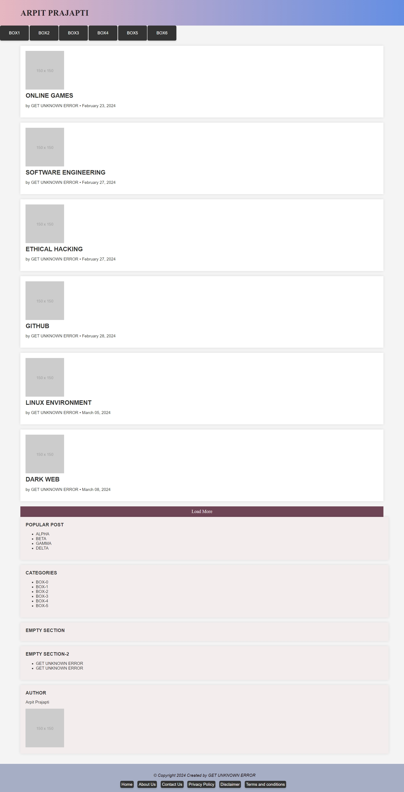

# Simple Web Project

This repository contains a simple web project with HTML, CSS, and JavaScript files. Additionally, it includes a script to start a Python HTTP server for serving the files locally.



## Project Structure


### Files

- `index.html`: The main HTML file for the web project.
- `styles.css`: The CSS file for styling the HTML page.
- `script.js`: The JavaScript file for adding interactivity.
- `start_server.sh`: A shell script to start a Python HTTP server.

## How to Run the Project Locally

### Prerequisites

- Python should be installed on your system. You can download it from [python.org](https://www.python.org/downloads/).

### Steps to Run

1. **Clone the repository:**

    ```sh
    git clone https://github.com/GET-UNKNOWN-ERR0R/Sample-Website.git
    cd Sample-Website
    ```

2. **Make the server script executable (if not already):**

    ```sh
    chmod +x start_server.sh
    ```

3. **Start the Python HTTP server:**

    ```sh
    ./start_server.sh
    ```

4. **Open your browser and go to:**

    ```
    http://localhost:8000
    ```

    You should see your `index.html` file rendered in the browser.


## License

This project is licensed under the MIT License. See the [LICENSE](LICENSE) file for more details.

